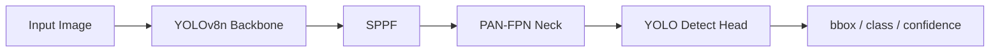
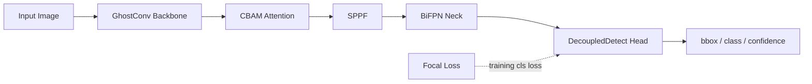

# FullModel 结构与 Diff 说明

## 改进前 Baseline



## 改进后 FullModel



## 模块 Diff

| 改进方向 | Baseline | FullModel | 代码入口 |
| --- | --- | --- | --- |
| 骨干网络优化 | 标准 Conv 下采样 | 部分 Backbone 下采样 Conv 替换为 GhostConv | `models/yolov8n_ghost.yaml`、`models/yolov8n_full.yaml` |
| 注意力机制 | 无显式注意力 | Backbone C2f 后插入 CBAM | `models/modules/cbam.py` |
| 特征融合 | PAN-FPN + Concat | BiFPN 加权双向融合 | `models/modules/bifpn.py` |
| 损失函数 | YOLOv8 分类 BCE | Focal Loss 分类项 | `models/losses/focal_loss.py` |
| 检测头 | YOLO Detect | DecoupledDetect 分类/回归解耦 | `models/modules/decoupled_head.py` |

## 配置开关

```yaml
enable_ghostconv: true
enable_cbam: true
enable_bifpn: true
enable_decoupled_head: true
enable_focal_loss: true
```

Baseline 保持 `configs/baseline.yaml` 与 `yolov8n.pt`，不启用上述结构改动。

## 正式训练结论

最终 11 组公平消融训练已完成，统一使用增强数据集、`epochs=150`、`imgsz=640`、`batch=16`，并通过 `yolov8n.pt` 进行预训练迁移。

| 实验 | mAP50 | mAP50-95 | FPS |
| --- | ---: | ---: | ---: |
| Baseline+CBAM | 0.99227 | 0.80125 | 242.11 |
| Baseline+CBAM+BiFPN | 0.99162 | 0.80076 | 302.73 |
| Baseline+GhostConv | 0.98915 | 0.79822 | 306.11 |
| Baseline | 0.99118 | 0.79532 | 304.50 |
| Baseline+DecoupledHead | 0.99133 | 0.79500 | 235.72 |
| Baseline+CBAM+BiFPN+GhostConv+DecoupledHead | 0.99026 | 0.79446 | 280.49 |
| Baseline+BiFPN | 0.99251 | 0.79234 | 299.28 |
| Baseline+CBAM+BiFPN+GhostConv | 0.98853 | 0.79027 | 287.42 |
| Baseline+CBAM+BiFPN+Focal | 0.99027 | 0.78909 | 198.90 |
| FullModel | 0.99012 | 0.78472 | 226.29 |
| Baseline+Focal | 0.98906 | 0.78438 | 235.14 |

最终部署并不选择 FullModel。FullModel 已验证完整训练链路和五项改进组合，但叠加 Focal Loss、GhostConv、CBAM、BiFPN 与 Decoupled Head 后 mAP50-95 低于 `Baseline+CBAM` 和 `Baseline+CBAM+BiFPN`。因此：

- Web/桌面端默认使用 `Baseline+CBAM+BiFPN`
- 最高精度参考使用 `Baseline+CBAM`
- 树莓派端使用 `Baseline+GhostConv`
- FullModel 和 Focal 相关模型作为负向消融结论保留
