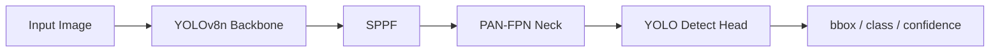
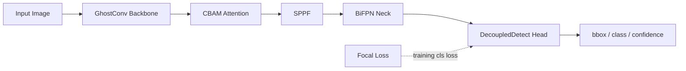

# FullModel 结构与 Diff 说明

## 改进前 Baseline



## 改进后 FullModel



## 模块 Diff

| 改进方向 | Baseline | FullModel | 代码入口 |
| --- | --- | --- | --- |
| 骨干网络优化 | 标准 Conv 下采样 | 部分 Backbone 下采样 Conv 替换为 GhostConv | `models/yolov8n_ghost.yaml`、`models/yolov8n_full.yaml` |
| 注意力机制 | 无显式注意力 | Backbone C2f 后插入 CBAM | `models/modules/cbam.py` |
| 特征融合 | PAN-FPN + Concat | BiFPN 加权双向融合 | `models/modules/bifpn.py` |
| 损失函数 | YOLOv8 分类 BCE | Focal Loss 分类项 | `models/losses/focal_loss.py` |
| 检测头 | YOLO Detect | DecoupledDetect 分类/回归解耦 | `models/modules/decoupled_head.py` |

## 配置开关

```yaml
enable_ghostconv: true
enable_cbam: true
enable_bifpn: true
enable_decoupled_head: true
enable_focal_loss: true
```

Baseline 保持 `configs/baseline.yaml` 与 `yolov8n.pt`，不启用上述结构改动。
