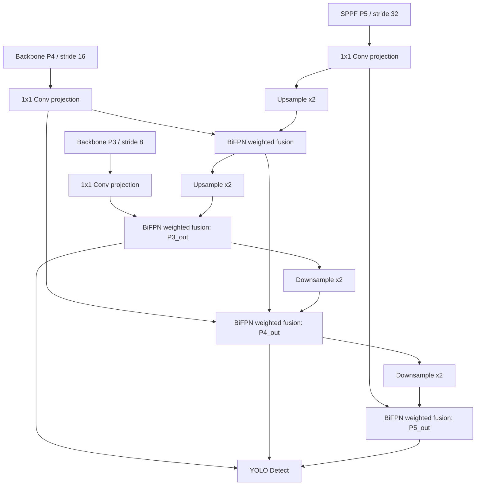

# BiFPN Neck 结构说明

本阶段只替换 YOLOv8 原始 PAN-FPN Neck，不实现 Focal Loss、GhostConv 等其他改进。Baseline 与 CBAM-only 结构仍可通过配置切换。

## 开关组合

| enable_cbam | enable_bifpn | 默认模型 |
| --- | --- | --- |
| false | false | `yolov8n.pt` |
| true | false | `models/yolov8n_cbam.yaml` |
| false | true | `models/yolov8n_bifpn.yaml` |
| true | true | `models/yolov8n_cbam_bifpn.yaml` |

## 结构图



## 融合权重

`BiFPNFusion` 为每个输入分支维护一个可学习权重，前向时执行：

```text
w_i = relu(raw_w_i) / (sum(relu(raw_w)) + epsilon)
```

归一化后的权重自动参与反向传播。融合后使用 depthwise separable convolution 进行特征整合。

## 兼容性

- BiFPN 输出仍是 P3/P4/P5 三个检测尺度，stride 保持 `[8, 16, 32]`。
- `enable_bifpn: false` 时继续使用原始 YOLOv8 PAN-FPN，不影响 Baseline 和 CBAM-only。
- `enable_cbam: true` 与 `enable_bifpn: true` 可同时启用，结构为 CBAM Backbone + BiFPN Neck。
